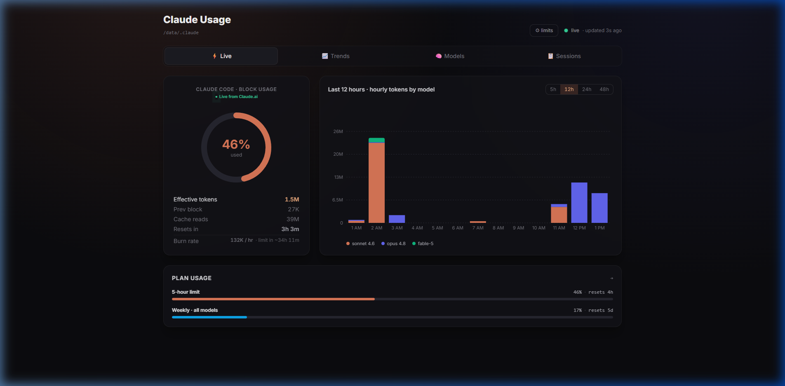
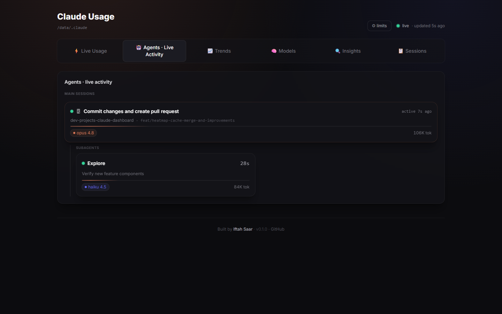
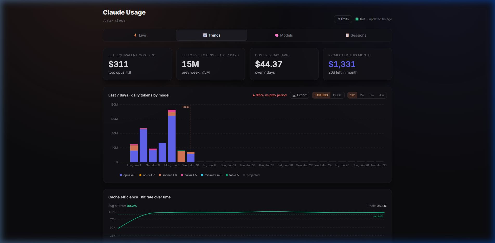
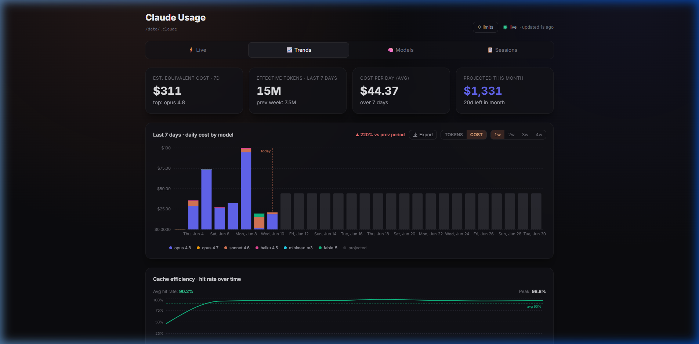
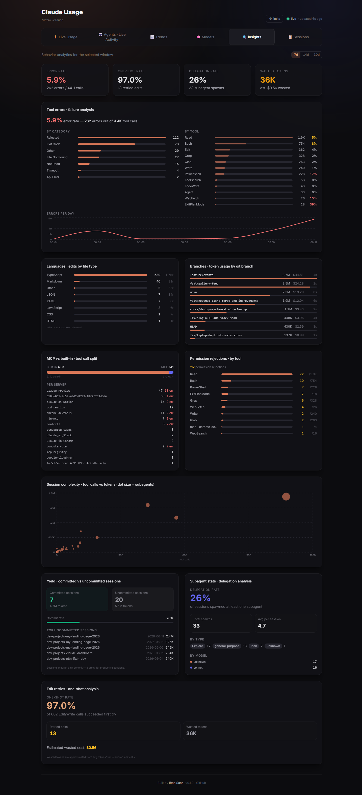
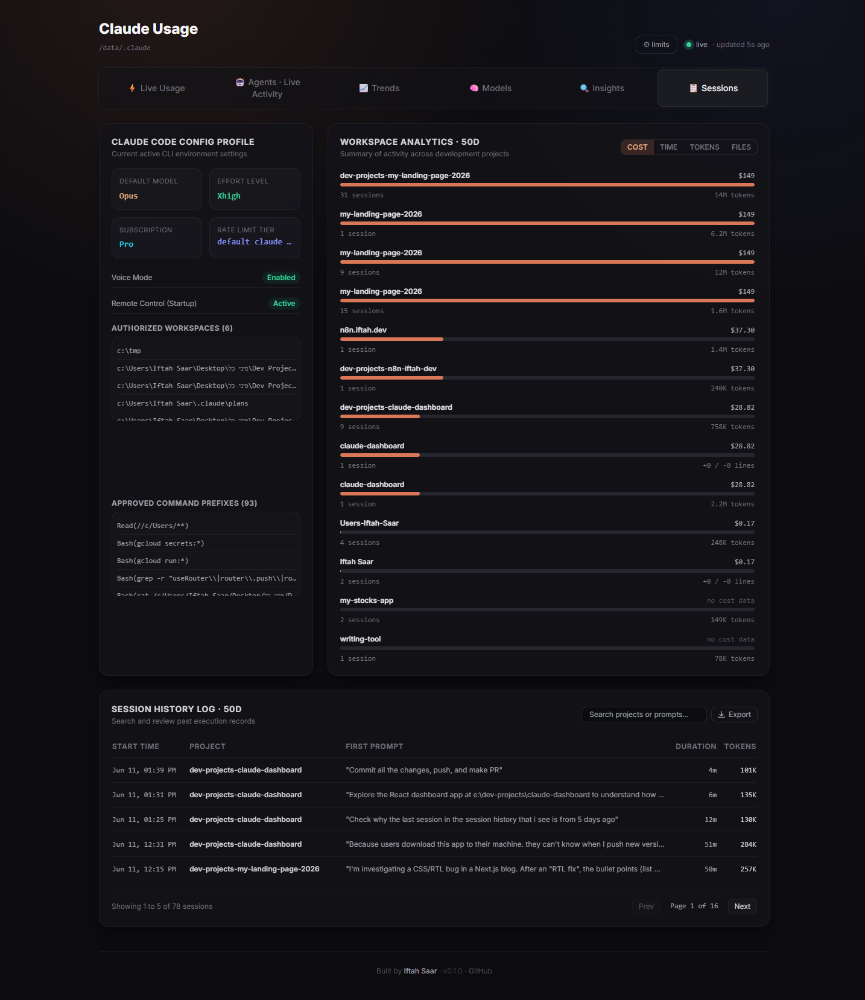

# Claude Dashboard

A beautiful, **local-first** dashboard for your [Claude Code](https://claude.com/claude-code) usage. It reads the JSON logs Claude Code already writes to `~/.claude` and visualizes them — no API key, no account login. Your usage logs never leave your machine; the app sends only anonymous feature-usage analytics, which you can switch off (see [Privacy & telemetry](#privacy--telemetry)).



## Interactive Features & Tour

The dashboard is structured into six functional tabs, each offering specialized insights into your development workflows and model usage. Tabs are deep-linkable (e.g. `/agents`, `/insights`), and an **in-app update banner** appears when a newer version has shipped.

### 1. ⚡ Live Usage Tab
* **Burn Rate Indicator**: Shows your current tokens/hour pace and time-to-limit countdown projection.
* **Plan Usage**: Tracks both your **5-hour active session limit** and your **weekly limit** utilisation percentage, displaying when the next reset will occur.
* **Active Session Stats**: Breakdown of effective tokens, previous session block sizes, cache reads, and live OAuth connection state from Claude.ai.
* **Offline Banner Guide**: Detects connection offline status and expired OAuth tokens, providing direct macOS, Linux, and Windows terminal command instructions to refresh them.
* **Daily/Weekly/Monthly Spending Limits**: Configure client-side spend caps in USD to see consumption progress bars estimated from local logs.

### 2. 🤖 Agents · Live Activity Tab
Real-time view of what Claude Code is doing **right now**, reconstructed live from the session transcripts on disk.
* **Live Main Sessions**: Each active session shows its first prompt, project, git branch, model, and effective tokens, with a sparkline of recent activity.
* **Live Subagents**: Spawned subagents (Task/Explore/etc.) appear nested under their parent session with their own model and token counts while they run, then settle into a recently-completed state.
* **Delegating State**: A parent session is marked *delegating* while its subagents are doing the work.
* **Idle Lifecycle**: Main sessions dim after 30s of inactivity and drop after 60s; completed subagents no longer keep an idle parent card alive.




### 3. 📈 Trends Tab
* **Tokens vs. Cost Chart Toggle**: Click to switch the daily stacked bar chart between **Tokens** and **Cost (USD)**.
* **Estimated Projection Area**: Shows a projected monthly cost reference bar for the remaining days of the month based on your daily average.
* **Cache Efficiency Over Time**: Line chart tracking your daily cache hit rate percentage (cache reads / total tokens).
* **Peak Hours Heatmap**: A 24-column × 7-row intensity grid showing token usage by hour of the day and day of the week.
* **Activity Grid**: A GitHub-style daily activity heatmap covering the last 18 weeks.

The daily bar chart can toggle dynamically between:
* **Tokens View**:
  
* **Cost (USD) View**:
  


### 4. 🧠 Models Tab
* **Model Breakdown**: Donut chart showing token share across Opus, Sonnet, and Haiku.
* **Model Cost-Efficiency**: Horizontal bar chart comparing USD cost per 1M effective tokens for each model.
* **Interactive Sandbox Calculator**: Sandbox to calculate costs dynamically based on model pricing rules (input, output, cache write, and cache read).
* **Tool Usage**: Visual breakdown of your most frequently called tools (e.g. Bash, Write, Grep, MCP tools).

### 5. 🔍 Insights Tab
Deep analytics mined from your session transcripts over a selectable window, surfacing patterns you can't see in raw token counts.
* **Headline Metrics**: Error rate, edit accuracy, delegation rate, and estimated wasted tokens at a glance.
* **Tool Errors & Failure Analysis**: Which tools fail most and why (by tool, by error type).
* **Languages by File Type** and **Branches by Git Branch**: Where your tokens actually go.
* **MCP Server Usage** and **Permission Rejections by Tool**: How external tools and gating affect your runs.
* **Session Complexity**: Scatter of tool calls vs. subagents per session.
* **Yield (Committed vs. Uncommitted)**, **Subagent Delegation**, and **Edit-Retry / One-Shot Accuracy**: Outcome quality across sessions.



### 6. 📋 Sessions Tab
* **Combo Profile**: Your Claude Code config at a glance — startup/output style, default model, authorized workspaces, approved command prefixes.
* **Workspace Analytics**: Summarizes and ranks estimated costs, tokens, sessions, and files modified across all your project directories. Supported on macOS, Linux, and Windows (with automatic drive letter and folder normalization).
* **Live Session History Log**: Rebuilt live from the JSONL transcripts (not stale sidecar files), so it never goes blank. Each row shows start time, project, first prompt, duration, and tokens, and is searchable by project or prompt.
* **Detailed Session Expansion**: Click any session log row to expand a drill-down showing message counts, git commits/pushes, lines added/removed, files modified, tool errors, a full tool invocation breakdown, and a collapsible transcript.
* **CSV/JSON Export**: Export session logs and trends datasets with a single click.



---

## Quick start

Requires [Node.js](https://nodejs.org) 18+.

```bash
git clone https://github.com/iftahs/claude-dashboard.git
cd claude-dashboard
npm install
npm run dev
```

Then open the URL Vite prints (default <http://localhost:5180>). The dashboard populates as soon as you've used Claude Code on this machine.

`npm run dev` starts two processes via `concurrently`:

- a small **Express backend** (port `8787`) that scans `~/.claude` and serves aggregated JSON,
- the **Vite** dev server for the React UI, which proxies `/api` to the backend.

## Run with Docker (always-on)

Want the dashboard always available without running `npm` each time? Run it as a container. It builds the UI, serves everything from one Express process on port `8787`, and mounts your `~/.claude` folder **read-only**.

1. Copy the env template and point it at your Claude data folder:

   ```bash
   cp .env.example .env
   ```

   Edit `.env` and set `CLAUDE_DIR_HOST` to your real path (use forward slashes on Windows):

   ```
   CLAUDE_DIR_HOST=C:/Users/you/.claude
   ```

2. Build and start:

   ```bash
   docker compose up -d --build
   ```

3. Open <http://localhost:8787>.

The container uses `restart: unless-stopped`, so it comes back automatically after a crash or reboot (as long as Docker Desktop is set to start on login). Stop it with `docker compose down`. To change the host port, edit the `ports` mapping in `docker-compose.yml` (e.g. `"9000:8787"`).

## Changing the Claude data folder

By default the backend reads from your home directory:

| OS | Default path |
|----|--------------|
| Windows | `C:\Users\<you>\.claude` |
| macOS / Linux | `~/.claude` |

This is detected automatically — the path shown in the dashboard header is just *your* machine's home folder at runtime. If your logs live somewhere else (a custom install, a backup, another user's export), point the backend at it with the `CLAUDE_DIR` environment variable:

**macOS / Linux**
```bash
CLAUDE_DIR="/path/to/.claude" npm run dev
```

**Windows (PowerShell)**
```powershell
$env:CLAUDE_DIR = "D:\backups\.claude"; npm run dev
```

**Windows (cmd)**
```cmd
set CLAUDE_DIR=D:\backups\.claude && npm run dev
```

To change the backend port, set `SERVER_PORT` (default `8787`). If you change it, update the proxy target in `vite.config.ts` to match.

## What this dashboard can and can't show

It reflects **only** what Claude Code records locally. Two things deliberately are **not** shown because they don't exist in the local logs:

- **The exact rate-limit reset time** and **remaining quota** — those live in Anthropic API response headers, which Claude Code doesn't persist to disk. Any countdown would be a guess, so it's omitted.
- **Claude.ai web usage** — that's server-side per-conversation and never written to `~/.claude`.

You *can* set a personal token cap in the ⚙ limits panel to see a "% used" gauge — that compares your real measured usage against a number you enter.

## Privacy & telemetry

Your Claude usage data — logs, tokens, project paths, session contents — **never leaves your machine**. The only network calls the dashboard makes for *your* data reuse the OAuth token Claude Code already stores locally to read live usage and your plan from Anthropic.

Separately, the app sends **anonymous product-analytics events** to [PostHog](https://posthog.com) so the author can see how many people use the dashboard and which features matter. This is deliberately minimal and privacy-hardened:

- **What's sent:** which tab is opened, exports, source-toggle/range changes, an anonymous install count, and a coarse plan/usage-mode label.
- **What's *never* sent:** OAuth tokens, file or project paths, project names, session IDs, transcript content, or any personal data. Browser autocapture and session replay are turned **off** so the UI's on-screen paths can't be scraped.
- **Opt out any time:**
  - In the app: **⚙ Settings → Telemetry → Disable anonymous analytics** (takes effect immediately, persisted in your browser).
  - At build time: build with `VITE_DISABLE_ANALYTICS=1` (set it in `.env` for Docker — see [`.env.example`](.env.example)) for a fully telemetry-free image.
- Analytics is also disabled automatically in local dev builds.

## Contributing

Contributions welcome! This is an open project:

- **Found a bug or have an idea?** [Open an issue](https://github.com/iftahs/claude-dashboard/issues).
- **Want to change something?** Fork the repo, create a branch, and [open a pull request](https://github.com/iftahs/claude-dashboard/pulls).

The `main` branch is maintained by the author; all external changes go through pull requests.

## License

[MIT](LICENSE) — free to use, modify, and distribute for everyone.

## Credits

Built by **Iftah Saar** — [iftah.dev](https://iftah.dev).
