# Claude Dashboard

A beautiful, **local-first** dashboard for your [Claude Code](https://claude.com/claude-code) usage. It reads the JSON logs Claude Code already writes to `~/.claude` and visualizes them — no API key, no account login. Your usage logs never leave your machine. Use the ChatGPT desktop app too? Its Codex transcripts in `~/.codex` get the same treatment, and a **Claude / Codex / Both** switcher in the header re-points the whole dashboard at either platform — or puts them side by side.

Two features are optional and opt-in network paths, both privacy-hardened: **anonymous product analytics** (PostHog — feature-usage events only, switchable off) and **AI Insights** (sends *aggregates only* — never transcripts or file paths — to a model you choose). See [Privacy & telemetry](#privacy--telemetry).

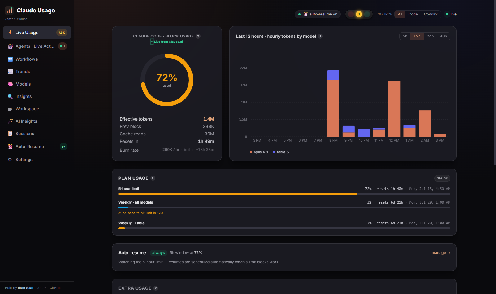

## Interactive Features & Tour

The dashboard is organized as a left **sidebar** with ten destinations. Views are deep-linkable (e.g. `/agents`, `/workflows`, `/ai`), live badges on the sidebar show running agents, the current 5-hour block % and in-flight workflows, and **toast notifications** surface update-available, connection, and account-mode notices.

### Platform switcher · Claude / Codex / Both

There is no separate Codex tab. When Codex data exists in `~/.codex`, a **platform** switcher appears in the header and re-points the *whole* dashboard:

* **Claude** — Claude Code (plus Cowork, via the secondary Code / Cowork / All source toggle). Exactly the dashboard below, unchanged. Users without Codex data never see the switcher and never leave this mode.
* **Codex** — the same tabs, reading the ChatGPT desktop agent instead: live 5-hour / weekly Codex limits, plan tier and credits on **Live**; running threads and their **guardian auto-reviews** on **Agents**; GPT models and OpenAI rate cards on **Models**; Codex threads with their real project paths on **Sessions**. Claude-only destinations (Workflows, Workspace) drop out of the sidebar, as do the panels with no Codex counterpart (git branches, permission rejections, slash commands).
* **Both** — everything combined, plus the comparisons that only exist side by side: a **Claude vs Codex daily chart** and a three-way **Claude Code / Cowork / Codex** split on Trends, a Claude/Codex sub-label on every spend card, and both vendors' rate cards on Models.

### 1. ⚡ Live Usage
* **Block Gauge**: The current 5-hour block as a radial gauge — effective tokens, % of limit, previous block, cache reads, live **burn rate** (tokens/hr) and a projected time-to-limit.
* **Plan Usage**: Your real subscription ceilings pulled live from Claude.ai — the **5-hour limit**, the **weekly all-models limit**, and **per-model weekly caps** (Opus / Sonnet / Fable / Cowork). Each bar shows % used, an exact countdown **and the absolute reset date & time**, plus a burn-rate forecast ("on pace to hit limit in ~3d") and your plan tier.
* **Extra Usage**: Anthropic's overage / credit pool — spend against the monthly limit, or an explanation when your org hasn't enabled it.
* **What's contributing to your limits usage?**: A cost-weighted breakdown of the day and week by **skill, subagent, plugin and MCP server**.
* **Spending limits**: Client-side USD caps (daily / weekly / monthly) with progress gauges.

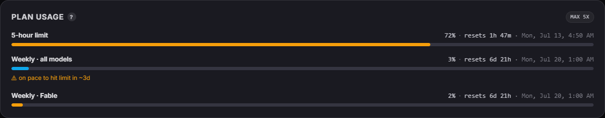

### 2. 🤖 Agents · Live Activity
Real-time view of what Claude Code is doing **right now**, reconstructed live from the session transcripts on disk.
* **Live Main Sessions**: Each active session shows its first prompt, project, git branch, model, and effective tokens.
* **Live Subagents**: Spawned subagents (Task/Explore/etc.) appear nested under their parent session with their own model and token counts while they run, then settle into a recently-completed state.
* **Traffic-light status**: Green = finished, amber = running, **red = waiting for you**. A red agent lights the header signal and the sidebar badge from any tab, and can raise a **browser notification and/or chime** (configurable in Settings).
* **Idle Lifecycle**: Main sessions dim after 30s of inactivity and drop after 60s; completed subagents no longer keep an idle parent card alive.

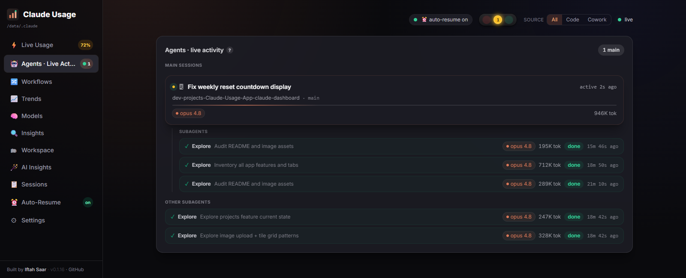

### 3. 🔀 Workflows
Live and recent **dynamic-workflow runs** (Claude Code's multi-agent orchestration), so you can watch a fan-out unfold.
* **Live Runs**: Phase progress with per-agent labels, model, tokens and tool calls.
* **All-time stats**: Runs, success rate, total tokens, agents spawned, average duration, top model, estimated cost, tool calls and your busiest day.
* **Recent Runs**: Grouped by Today / Yesterday / earlier (90-day window), each expandable to its result summary.

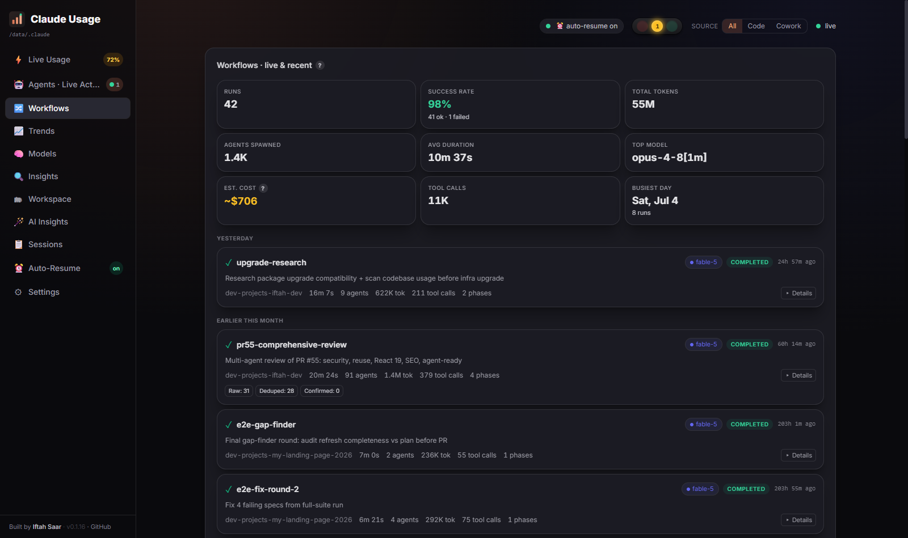

### 4. 📈 Trends
* **Tokens vs. Cost toggle**: Switch the daily stacked bar chart between **Tokens** and **Cost (USD)**, over a 1–4 week window.
* **Projection**: A dotted projection past today, plus projected month-end cost.
* **Cache Efficiency**: Daily cache hit-rate line (cache reads / total tokens).
* **Peak Hours Heatmap** (7×24) and an 18-week **Activity Grid**.
* **Spend report**: One-click **CSV / JSON export** of the full report (summary + per-day + per-model), plus a separate export on the daily chart.
* **Sources split** (when Cowork data exists) and an **"Actual billed"** section when a [LiteLLM gateway](#optional-integrations) is configured.

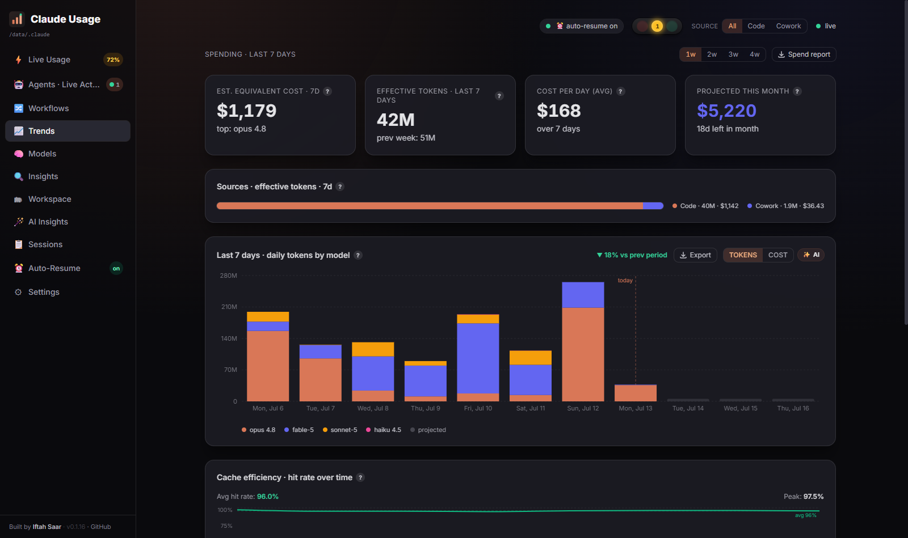

### 5. 🧠 Models
* **Model Breakdown**: Donut of token share across your models, with **$ per 1M effective tokens** for each.
* **Tool Usage**: Your most frequently called tools (Bash, Read, Edit, MCP tools…).
* **Cost Calculation Explained**: A per-model pay-as-you-go price table (input / output / cache-write / cache-read per 1M) and an **interactive calculator** you can drag to price any token mix.

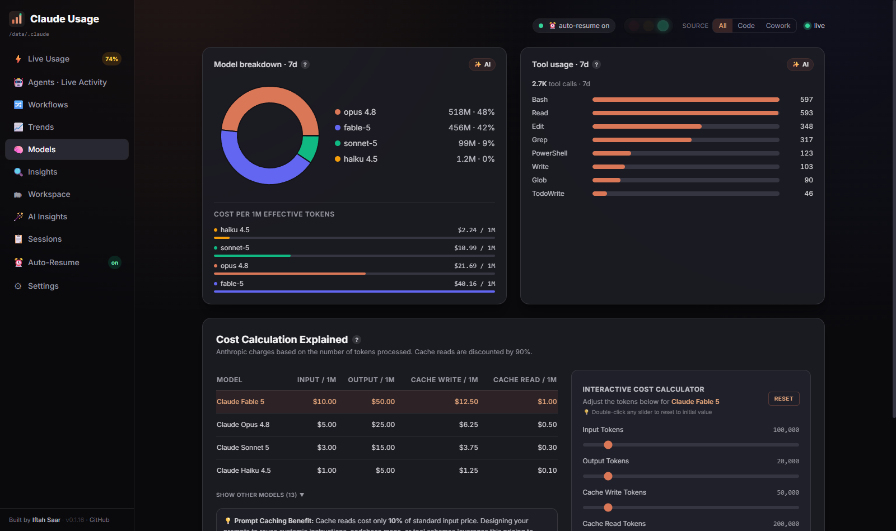

### 6. 🔍 Insights
Deep analytics mined from your session transcripts over a 7 / 14 / 30-day window, surfacing patterns you can't see in raw token counts. Every panel has an **✨ AI** button that explains it in plain language.
* **Headline Metrics**: Error rate, one-shot rate, delegation rate, and estimated wasted tokens.
* **Tool Errors**: Which tools fail most, by category and by tool, with errors-per-day.
* **Languages by file type**, **tokens by git branch**, **MCP vs built-in** tool split, and **permission rejections by tool**.
* **Session Complexity**, **Yield (committed vs uncommitted)**, **Subagent delegation**, **Edit-retry / one-shot accuracy**, **slash-command & skill usage**, and **file churn**.

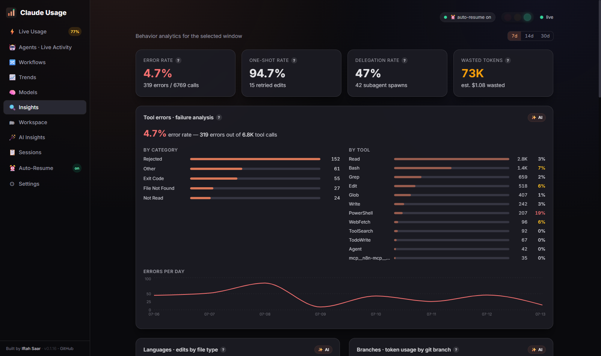

### 7. 🗂 Workspace
Your Claude Code working state on disk, beyond raw usage.
* **Tasks**: Counts by status (completed / in-progress / pending / blocked) with completion %.
* **Plans**: The plan documents under `~/.claude/plans` with title, age, and size.
* **Plugins & MCP Inventory**: Installed plugins and marketplaces, registered MCP servers (with scope), hooks, and your effort level / default model.

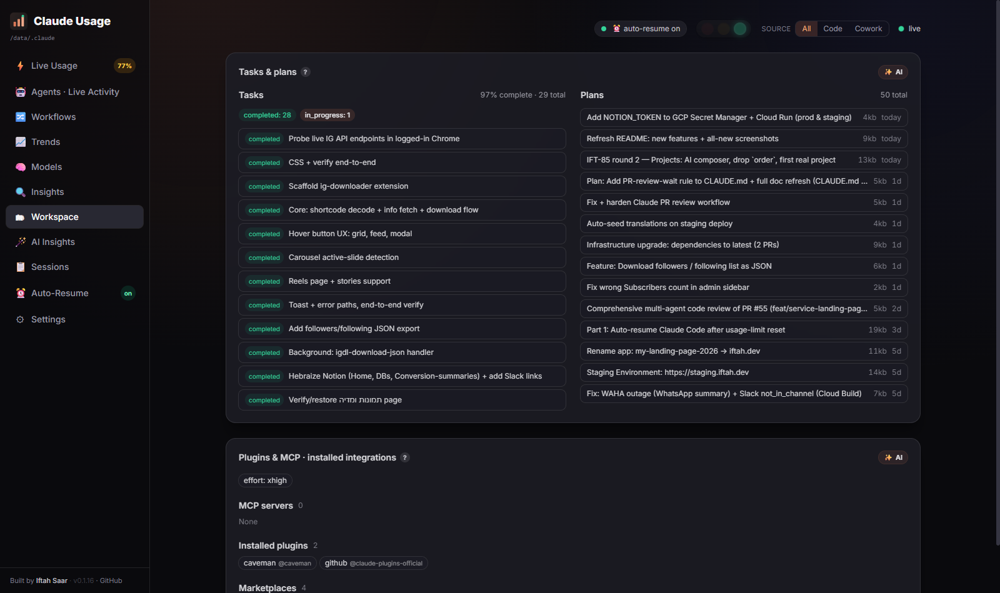

### 8. 🪄 AI Insights
Ask questions about your own usage in plain language, and get per-section explanations on demand.
* **Chat**: A streaming conversation over your usage **aggregates** ("which project costs the most?", "am I retrying edits too much?"), with conversation-aware follow-up suggestions. The model only ever sees aggregate metrics — no transcripts, no file paths.
* **Per-section ✨ AI**: An "✨ AI" button on most panels writes a short plain-language summary of just that chart.
* **Bring-your-own backend**: Works out of the box with the local `claude` CLI or your Claude.ai token; or set a provider + model + API key (Claude / OpenAI / Gemini) in Settings. The badge in the corner names whichever backend answered. See [AI Insights privacy](#ai-insights-opt-in).

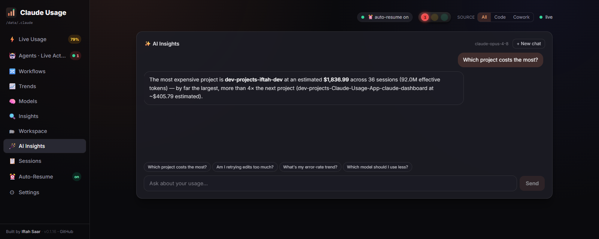

### 9. 📋 Sessions
* **Config Profile**: Your Claude Code config at a glance — default model, effort level, subscription / rate-limit tier, permission mode, auto-update channel, authorized workspaces, and approved command prefixes.
* **Workspace Analytics**: Ranks estimated cost, time, tokens and files modified across all your project directories — each project taggable, with a **spend-by-tag** rollup.
* **Session History Log**: Rebuilt live from the JSONL transcripts (not stale sidecar files). Each row shows start time, project, first prompt, duration and tokens, with **full-text search across transcripts** and **CSV/JSON export**.
* **Transcript modal**: Click any session to read the whole run — per-turn tool chips, models and compaction count.

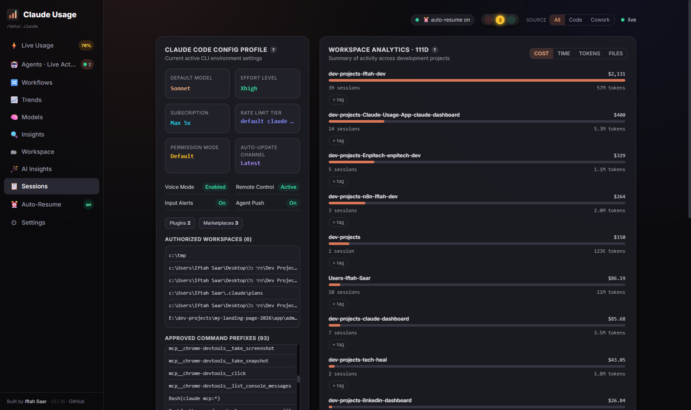

### 10. ⚙ Settings
A full-screen settings view (pinned to the bottom of the sidebar) for **usage mode** (auto / subscription / API), **agent alerts** (visual / notification / sound), **week start**, **spending limits** + **budget alerts** (first crossing of 70 / 90 / 100% of a cap), **AI Insights** (provider, model, API key — stored only in your browser), and **telemetry** opt-out.

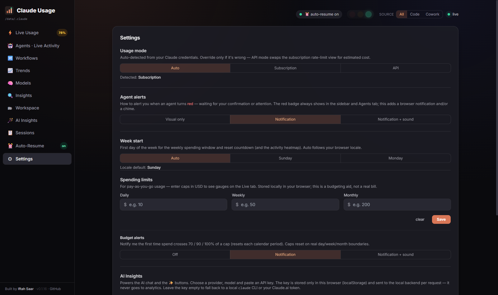

---

## Quick start

Requires [Node.js](https://nodejs.org) 20+ (the active LTS — some dependencies require it).

```bash
git clone https://github.com/iftahs/claude-dashboard.git
cd claude-dashboard
npm install
npm run dev
```

Then open the URL Vite prints (default <http://localhost:5180>). The dashboard populates as soon as you've used Claude Code on this machine.

`npm run dev` starts two processes via `concurrently`:

- a small **Express backend** (port `8788` in dev) that scans `~/.claude` and serves aggregated JSON,
- the **Vite** dev server for the React UI, which proxies `/api` to the backend.

Other scripts:

```bash
npm run build     # typecheck (tsc -b) + production build into dist/
npm run preview   # serve the built dist/ locally
npm run docker:up # rebuild + (re)start the container — run after every code change
npm run docker:down
npm run docker:logs
```

There is no test or lint script — a clean `npx tsc -b` (TypeScript `strict`) is the bar.

## Run with Docker (always-on)

Want the dashboard always available without running `npm` each time? Run it as a container. It builds the UI, serves everything from one Express process on port `8787`, and mounts your `~/.claude` folder **read-only**.

1. Copy the env template and point it at your Claude data folder:

   ```bash
   cp .env.example .env
   ```

   Edit `.env` and set `CLAUDE_DIR_HOST` to your real path (use forward slashes on Windows):

   ```
   CLAUDE_DIR_HOST=C:/Users/you/.claude
   ```

   If you use the ChatGPT desktop app, `npm run docker:up` also fills in `CODEX_DIR_HOST` (your `~/.codex`) so the container can read Codex data; leave it blank to opt out.

   To enable the **AI Insights** backend in Docker, either set `WITH_CLAUDE_CLI=1` (bundles the `claude` CLI so it can run `claude -p` against your mounted token) or provide an `ANTHROPIC_API_KEY` — both are documented in [`.env.example`](.env.example). You can also just set an API key at runtime in ⚙ Settings instead.

2. Build and start:

   ```bash
   npm run docker:up          # or: docker compose up -d --build
   ```

3. Open <http://localhost:8787>.

The container uses `restart: unless-stopped`, so it comes back automatically after a crash or reboot (as long as Docker Desktop is set to start on login). Stop it with `npm run docker:down`. To change the host port, edit the `ports` mapping in `docker-compose.yml` (e.g. `"9000:8787"`).

> **Docker has no hot reload.** After any code change, run `npm run docker:up` again to rebuild and restart.

## Optional integrations

All are auto-detected — if you don't use them, nothing changes in the UI.

- **Cowork** — Claude's desktop app writes standard Claude Code JSONL in its own folder. When the dashboard finds it, a **source toggle (Code / Cowork / All)** appears in the header and a Code-vs-Cowork split shows up on Trends. Code-only users see the dashboard unchanged. Point `COWORK_DIR` / `COWORK_DIR_HOST` at it only if it lives somewhere non-standard.
- **ChatGPT desktop / Codex** — the ChatGPT desktop app's coding agent (Codex) keeps its transcripts in `~/.codex`. When that folder exists a **[platform switcher](#platform-switcher--claude--codex--both) (Claude / Codex / Both)** appears in the header and re-points the whole dashboard — Live, Agents, Trends, Models, Sessions, Projects and Insights all read Codex instead of Claude, or both at once with a side-by-side daily comparison. Costs for Codex are OpenAI list-price estimates (gpt-5.5 / gpt-5.6 / gpt-6 rates; the internal review model is unpriced). Set `CODEX_DIR` / `CODEX_DIR_HOST` only for a non-standard location; `npm run docker:up` writes `CODEX_DIR_HOST` for you, and a blank value opts out.
- **LiteLLM gateway** — if you route Claude Code through a [LiteLLM](https://litellm.ai) proxy, set `LITELLM_BASE_URL` / `LITELLM_API_KEY` (or just reuse `ANTHROPIC_BASE_URL` / `ANTHROPIC_AUTH_TOKEN`) and the dashboard will show your **real billed cost** — month-to-date and per-day on Trends, and against your spend caps — instead of the estimate.

## macOS: keeping the OAuth token fresh

On macOS, Claude Code stores its OAuth token in the **Keychain**, which a Docker container can't reach. `npm run docker:up` therefore copies the token into `~/.claude/.dashboard-oauth-cache.json` (read by the container) *and* installs a small launchd agent (`com.claude-dashboard.token-sync`) that re-syncs it every 15 minutes — otherwise the snapshot's access token expires within hours and the Live tab degrades to "OAuth token expired". The running container picks up the refreshed file automatically; no rebuild or restart needed.

- `npm run token-sync:status` — check the agent + cached-token health
- `npm run token-sync` — one-shot manual sync
- `npm run token-sync:uninstall` — remove the agent (the Live tab will then show "OAuth token expired" a few hours after each `docker:up`)
- Log: `~/Library/Logs/claude-dashboard/token-sync.log`

The agent bakes in the absolute paths of your `node` binary and this repo, so re-run `npm run token-sync:install` (or just `npm run docker:up`, which self-heals it) after upgrading/removing that Node version or moving the repo. If you have several checkouts, the last one to install wins — harmless, they all write the same cache file. **Linux/Windows are unaffected**: there Claude Code keeps `~/.claude/.credentials.json` fresh itself and the container reads it directly.

## Changing the Claude data folder

By default the backend reads from your home directory:

| OS | Default path |
|----|--------------|
| Windows | `C:\Users\<you>\.claude` |
| macOS / Linux | `~/.claude` |

This is detected automatically — the path shown in the dashboard header is just *your* machine's home folder at runtime. If your logs live somewhere else (a custom install, a backup, another user's export), point the backend at it with the `CLAUDE_DIR` environment variable:

**macOS / Linux**
```bash
CLAUDE_DIR="/path/to/.claude" npm run dev
```

**Windows (PowerShell)**
```powershell
$env:CLAUDE_DIR = "D:\backups\.claude"; npm run dev
```

**Windows (cmd)**
```cmd
set CLAUDE_DIR=D:\backups\.claude && npm run dev
```

To change the backend port, set `SERVER_PORT`. If you change it, update the proxy target in `vite.config.ts` to match.

## What this dashboard can and can't show

Everything is derived from what Claude Code records locally, plus the OAuth token it already stores — which is enough to show your **real** limits:

- ✅ **Exact reset times and % used** for the 5-hour window, the weekly all-models cap and each per-model cap, read live from Anthropic's usage API with your existing token — including your plan tier and any extra-usage credits.
- ⚠️ **Costs are an *estimated equivalent* API price.** A subscription has no per-token bill, so the dollar figures answer "what would this have cost on pay-as-you-go?" — they are not an invoice. Configure a [LiteLLM gateway](#optional-integrations) to see real billed amounts instead.
- ❌ **Claude.ai web / desktop chat usage** — that's server-side per-conversation and never written to `~/.claude`.
- ❌ **Cowork sessions running in full-VM sandbox mode** — their transcripts stay inside the VM, so there's nothing on disk to read.
- ⚠️ **Codex (ChatGPT desktop)** — local rollouts cover threads run on this machine; Codex Cloud tasks, ChatGPT web chats and mobile usage only appear in the server-side daily series the Codex platform view fetches with your token. Guardian auto-review tokens are folded into their parent thread.

You can also set your own USD **spending caps** in ⚙ Settings to get gauges and budget alerts against those estimates.

## Privacy & telemetry

Your Claude usage data — logs, tokens, project paths, session contents — **never leaves your machine**. The only network calls the dashboard makes for *your* data reuse the OAuth token Claude Code already stores locally to read live usage and your plan from Anthropic, and — when the ChatGPT desktop app is installed — the token in `~/.codex/auth.json` to read your Codex limits and daily totals from OpenAI (`chatgpt.com/backend-api/wham/usage` and `/wham/profiles/me`; two GETs, never a token refresh, account id / e-mail stripped before anything reaches the UI). Beyond that, exactly two optional, opt-in paths reach the network:

### Anonymous product analytics

The app sends **anonymous product-analytics events** to [PostHog](https://posthog.com) so the author can see how many people use the dashboard and which features matter. This is deliberately minimal and privacy-hardened:

- **What's sent:** which tab is opened, exports, source-toggle/range changes, an anonymous install count, and a coarse plan/usage-mode label.
- **What's *never* sent:** OAuth tokens, file or project paths, project names, session IDs, transcript content, or any personal data. Browser autocapture and session replay are turned **off** so the UI's on-screen paths can't be scraped.
- **Opt out any time:**
  - In the app: **⚙ Settings → Telemetry → Disable anonymous analytics** (takes effect immediately, persisted in your browser).
  - At build time: build with `VITE_DISABLE_ANALYTICS=1` (set it in `.env` for Docker — see [`.env.example`](.env.example)) for a fully telemetry-free image.
- Analytics is also disabled automatically in local dev builds.

### AI Insights (opt-in)

The AI Insights tab and the per-section "✨ AI" buttons call a model **only when you ask** (open the tab, send a message, or click a button). What's sent is a **privacy-safe aggregate summary** — weekly totals, top models/tools/projects (project *basenames* only), error/retry/delegation rates, and similar metrics.

- **What's *never* sent:** transcripts or message contents, full file/project paths, session IDs, or your OAuth token.
- **Which backend serves the call** (first available wins): an API key you set in **⚙ Settings → AI Insights** (Claude / OpenAI / Gemini, stored only in your browser) → a server-side `ANTHROPIC_API_KEY` → the local `claude` CLI (`claude -p`, uses your subscription) → your Claude.ai OAuth token → otherwise the feature shows setup instructions and does nothing.
- **Server-side defaults** for Docker/self-host live in [`.env.example`](.env.example): `WITH_CLAUDE_CLI=1`, `ANTHROPIC_API_KEY`, and `AI_MODEL` (default `claude-opus-5`).
- If you never open the AI tab or click "✨ AI", **no aggregates are ever sent.**

## Contributing

Contributions welcome! This is an open project:

- **Found a bug or have an idea?** [Open an issue](https://github.com/iftahs/claude-dashboard/issues).
- **Want to change something?** Fork the repo, create a branch, and [open a pull request](https://github.com/iftahs/claude-dashboard/pulls).

The `main` branch is maintained by the author; all external changes go through pull requests.

## License

[MIT](LICENSE) — free to use, modify, and distribute for everyone.

## Credits

Built by **Iftah Saar** — [iftah.dev](https://iftah.dev).
