# AI Usage

A calm, **local-first** dashboard for your [Claude Code](https://claude.com/claude-code) usage (the `claude-dashboard` repository; the app calls itself **AI Usage**). It reads the JSON logs Claude Code already writes to `~/.claude` and visualizes them — no API key, no account login. Your usage logs never leave your machine. Use Claude Cowork or the ChatGPT desktop app too? Cowork sessions are picked up from the same kind of logs, and the Codex transcripts in `~/.codex` get the same treatment: a **Claude / Codex / Both** switcher in the top bar re-points the whole dashboard at either platform — or puts them side by side.

Two features are optional and opt-in network paths, both privacy-hardened: **anonymous product analytics** (PostHog — feature-usage events only, switchable off) and **AI insights** (sends *aggregates only* — never transcripts or file paths — to a model you choose). See [Privacy & telemetry](#privacy--telemetry).

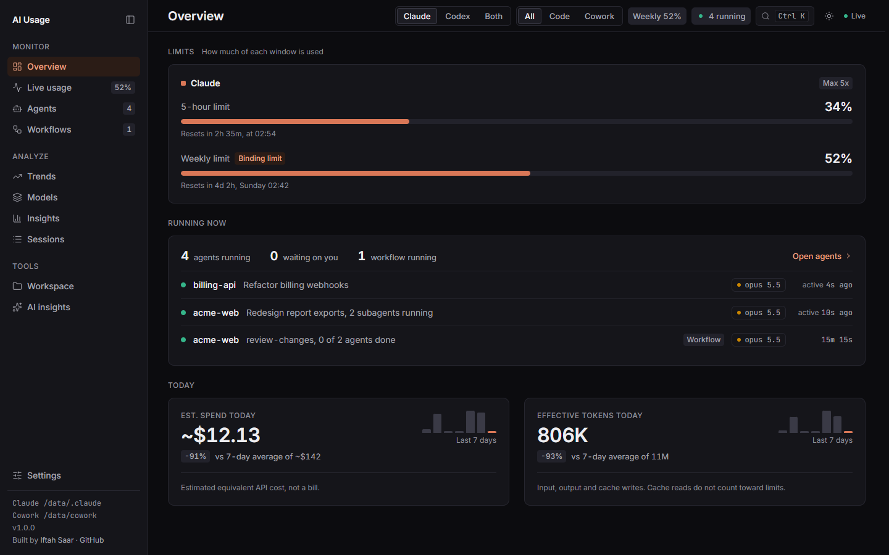

## Interactive Features & Tour

The dashboard is a grouped **sidebar** plus a sticky **top bar**. Pages are deep-linkable (e.g. `/overview`, `/agents`, `/workflows`, `/ai`; an unknown path shows Overview), the sub-views inside a page have their own link (`/trends?view=efficiency`), and **toast notifications** surface update-available, connection, and account-mode notices.

### Layout & navigation

* **Sidebar** — the pages in three groups: **Monitor** (Overview, Live usage, Agents, Workflows), **Analyze** (Trends, Models, Insights, Sessions) and **Tools** (Workspace, AI insights), with Settings pinned below them. It collapses to a narrow icon rail, and below 1024 px it turns into a drawer you open from the top bar. Live badges show agents that are running or waiting on you, the current binding limit % (the fuller of the 5-hour and weekly windows) and in-flight workflows.
* **Top bar** — the page title, the **platform switcher** (Claude / Codex / Both), the **surface toggle** (All / Code / Cowork), a **running-agents chip**, the **limit status**, the command palette button, the theme toggle and a live-data indicator. The surface toggle shows only when Cowork data exists and the platform is Claude, and is hidden on Agents.
* **Command palette** — press **Ctrl+K** (**⌘K** on macOS) to jump to any page, switch the platform, surface or theme, jump straight to a Settings section, or export the current view as CSV / JSON.
* **Themes** — dark (the default) and light, switched from the top bar, **Settings → Display** or the palette, and remembered per browser. The look is flat and quiet with a single accent colour and a 12 px minimum text size; Inter and JetBrains Mono ship with the app, so the UI never requests Google Fonts.
* **Screen sizes** — the layout holds down to tablet width (about 768 px).

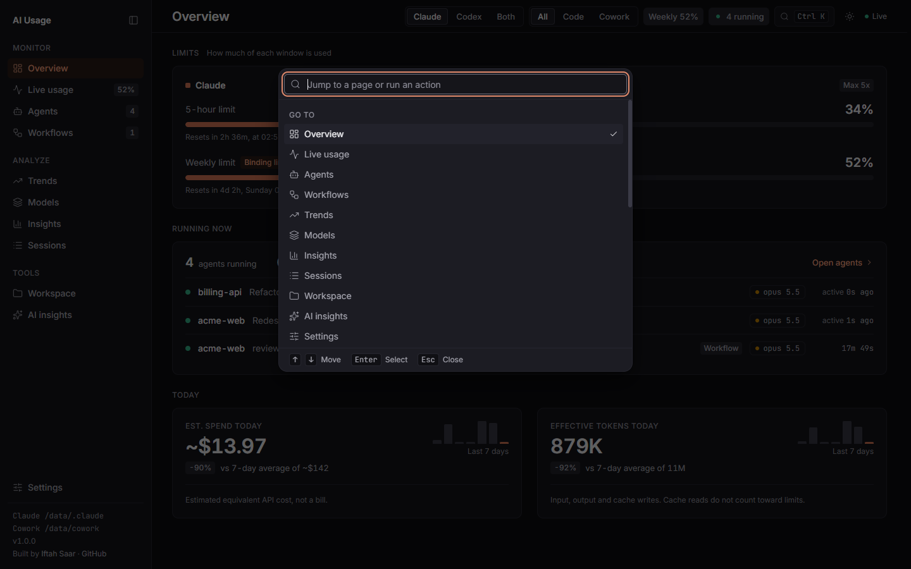

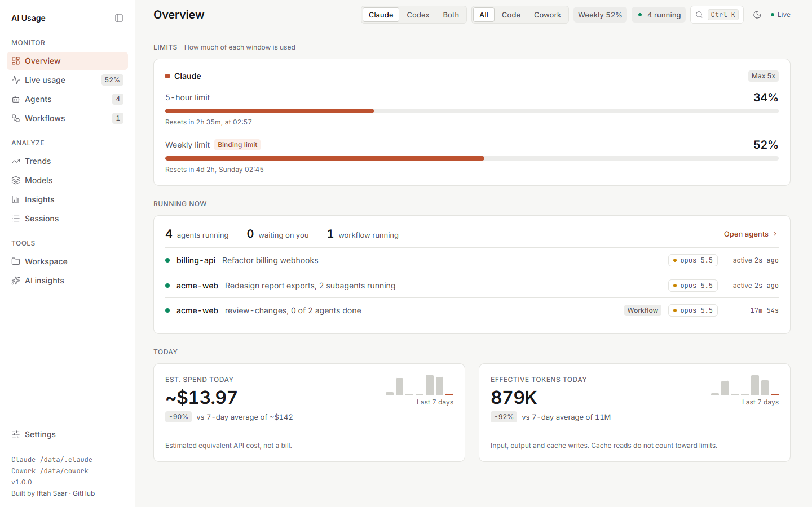

### Platform switcher · Claude / Codex / Both

There is no separate Codex page. When Codex data exists in `~/.codex`, a **platform** switcher appears in the top bar and re-points the *whole* dashboard:

* **Claude** — Claude Code (plus Cowork, via the secondary All / Code / Cowork surface toggle). Exactly the dashboard below, unchanged. Users without Codex data never see the switcher and never leave this mode.
* **Codex** — the same pages, reading the ChatGPT desktop agent instead: live 5-hour / weekly Codex limits, plan tier and credits on **Live usage**; running threads and their **guardian auto-reviews** on **Agents**; GPT models and OpenAI rate cards on **Models**; Codex threads with their real project paths on **Sessions**. Every page keeps the same panels as under Claude; the one page that drops out of the sidebar is **Workflows**, since Codex records no workflow runs.
* **Both** — everything combined, plus the comparisons that only exist side by side: a **Claude vs Codex daily chart** and a three-way **Claude Code / Cowork / Codex** split on Trends, a Claude/Codex sub-label on every spend card, and both vendors' rate cards on Models.

### Overview
The landing page: three groups that answer "where do I stand?" at a glance.
* **Limits**: The 5-hour and weekly windows for each platform, with % used and the reset time.
* **Running now**: The agents working right now, the ones waiting on you, and running workflows.
* **Today**: Estimated spend and effective tokens so far today against your 7-day average.

### Live usage
Four groups, from the current window down to your own caps.
* **Current window**: The current 5-hour block as a gauge — effective tokens, % of limit, previous block, cache reads, live **burn rate** (tokens/hr) and a projected time-to-limit — beside a usage chart you can re-window by hours.
* **Plan limits**: Your real subscription ceilings pulled live from Claude.ai — the **5-hour limit**, the **weekly all-models limit**, and **per-model weekly caps** (Opus / Sonnet / Fable / Cowork). Each bar shows % used, an exact countdown **and the absolute reset date & time**, plus a burn-rate forecast ("on pace to hit limit in ~3d") and your plan tier. Next to it, **Extra usage**: Anthropic's overage / credit pool — spend against the monthly limit, or an explanation when your org hasn't enabled it.
* **Drivers**: What's contributing to your limits usage — a cost-weighted breakdown of the day and week by **skill, subagent, plugin and MCP server** — and the **limit hits** you ran into.
* **Spend against your caps**: Client-side USD caps (daily / weekly / monthly) with progress gauges.

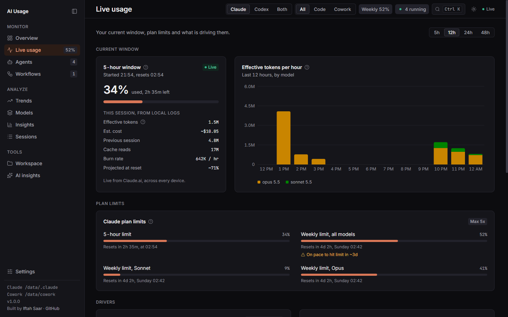

### Agents
Real-time view of what your agents are doing **right now**, reconstructed live from the session transcripts on disk.
* **Now**: Each active main session shows its first prompt, project, git branch, model, and effective tokens, with its spawned subagents (Task/Explore/etc.) nested beneath it with their own model and token counts while they run, then settling into a recently-completed state.
* **Traffic-light status**: Green = finished, amber = running, **red = waiting for you**. A session whose turn finished cleanly shows as "your turn" for up to five minutes — a soft state, never an alert. A red agent lights the top-bar chip and the sidebar badge from any page, and can raise a **browser notification and/or chime** (configurable in Settings → Alerts).
* **History**: Subagent spawns over the last 30 days — how many, how many per session that delegated, and which types did the work.

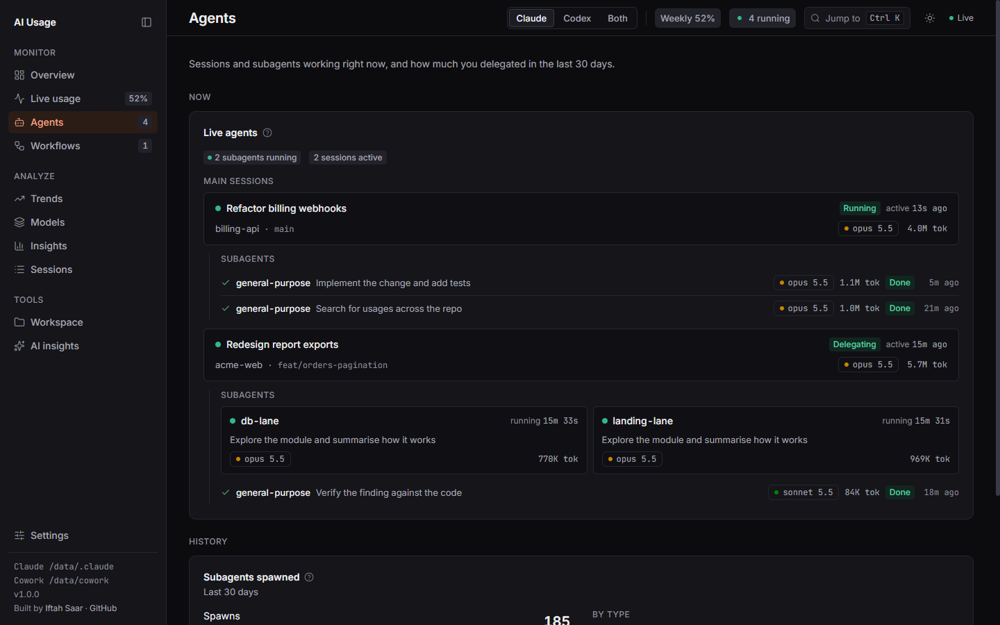

### Workflows
Live and recent **dynamic-workflow runs** (Claude Code's multi-agent orchestration), so you can watch a fan-out unfold.
* **Live Runs**: Phase progress with per-agent labels, model, tokens and tool calls.
* **All-time stats**: Runs, success rate, total tokens, agents spawned, average duration, top model, estimated cost, tool calls and your busiest day.
* **Recent Runs**: Grouped by Today / Yesterday / earlier (90-day window), each expandable to its result summary.

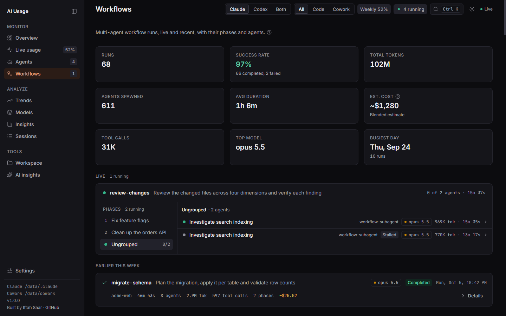

### Trends
Three sub-tabs, with a range selector from 1 week to 1 year (1w · 2w · 1m · 2m · 3m · 6m · 1y) and a one-click **CSV / JSON export** of the full spend report (summary + per-day + per-model).
* **Spend**: Summary tiles and the daily stacked bar chart, switchable between **Tokens** and **Cost (USD)**, with a dotted projection past today and a projected month-end cost; a separate export on the daily chart. A **sources split** (when Cowork data exists), the **Claude vs Codex** comparison under Both, and an **"Actual billed"** card when a [LiteLLM gateway](#optional-integrations) is configured.
* **Efficiency**: Daily cache hit-rate line (cache reads / total tokens).
* **Activity**: The **Peak Hours Heatmap** (7×24), an activity summary and an 18-week **Activity Grid**.

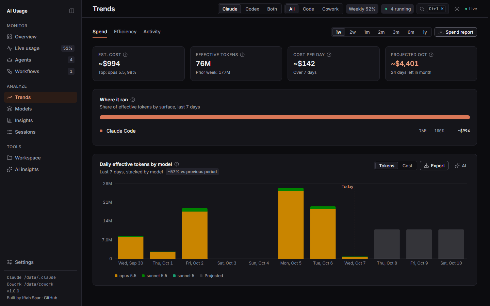

### Models
* **Mix**: A donut of token share across your models with **$ per 1M effective tokens** for each, next to the **reasoning effort** levels you ran them at.
* **Pricing**: A per-model pay-as-you-go price table (input / output / cache-write / cache-read per 1M) and an **interactive calculator** — type a token count for each kind to price any mix.

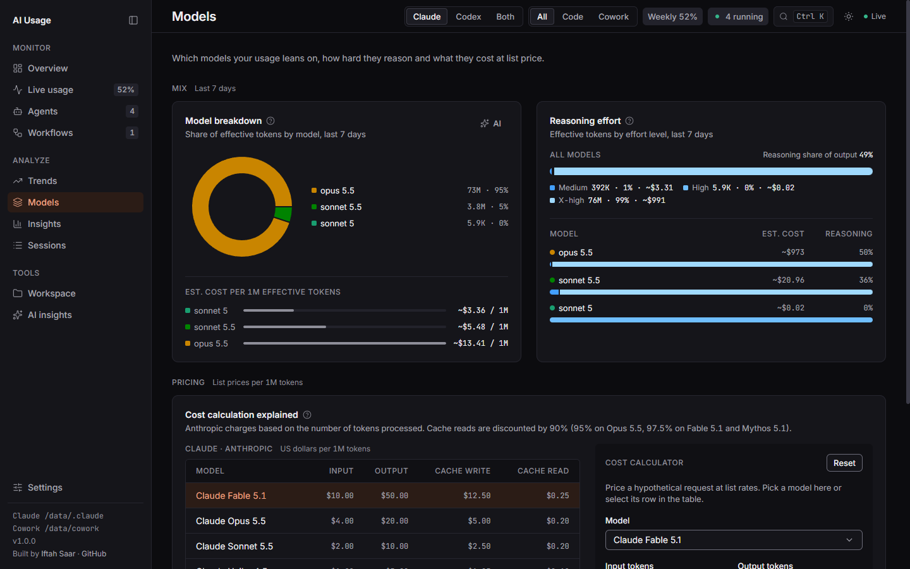

### Insights
Deep analytics mined from your session transcripts over a 7 / 14 / 30-day window, surfacing patterns you can't see in raw token counts. A summary row (error rate, one-shot rate, delegation rate, estimated wasted tokens) sits above four sub-tabs, and each loads its data only when you open it. Most panels have an **AI** button that explains the panel in plain language.
* **Reliability**: Which tools fail most, by category and by tool, with errors-per-day; **permission rejections by tool**; **edit-retry / one-shot accuracy**.
* **Tools**: **Tool usage** (Bash, Read, Edit, MCP tools…), the **MCP vs built-in** split, **slash-command & skill usage** and **subagent delegation**.
* **Code**: **Languages by file type**, **tokens by git branch**, **Yield** (committed vs uncommitted) and **file churn**.
* **Pace**: **Session complexity** and **turn latency**.

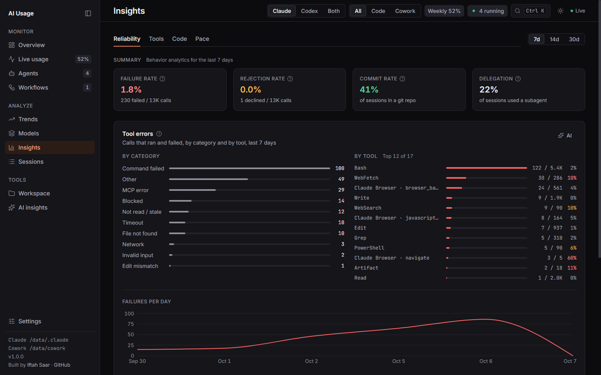

### Sessions
* **Sessions**: The session history log, rebuilt live from the JSONL transcripts (not stale sidecar files). Each row shows start time, project, first prompt, duration and tokens, 20 rows to a page, with **full-text search across transcripts** and **CSV/JSON export**. Click any session to read the whole run — per-turn tool chips, models and compaction count.
* **Projects and tags**: Ranks estimated cost, time, tokens and files modified across all your project directories — each project taggable, with a **spend-by-tag** rollup.

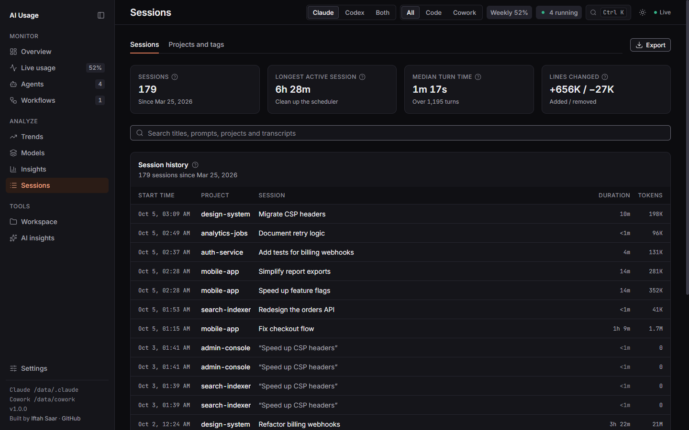

### Workspace
Your agent working state on disk, beyond raw usage.
* **Profile**: Your Claude Code config at a glance — default model, effort level, subscription / rate-limit tier, permission mode, auto-update channel, authorized workspaces, and approved command prefixes (and Codex's config, under Codex or Both).
* **Integrations**: What is installed on this machine — MCP servers, plugins, marketplaces, skills, automations and hooks.
* **Tasks and plans**: Task counts by status (completed / in-progress / pending / blocked) with completion %, and the plan documents under `~/.claude/plans` with title, age, and size.

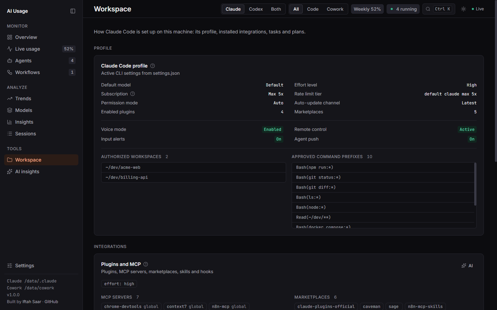

### AI insights
Ask questions about your own usage in plain language, and get per-section explanations on demand.
* **Chat**: A streaming conversation over your usage **aggregates** ("which project costs the most?", "am I retrying edits too much?"), with conversation-aware follow-up suggestions. The model only ever sees aggregate metrics — no transcripts, no file paths.
* **Per-section AI buttons**: A sparkles button on most panels writes a short plain-language summary of just that chart.
* **Bring-your-own backend**: Works out of the box with the local `claude` CLI or your Claude.ai token; or set a provider + model + API key (Claude / OpenAI / Gemini) in Settings → AI. The badge in the corner names whichever backend answered. See [AI insights privacy](#ai-insights-opt-in).

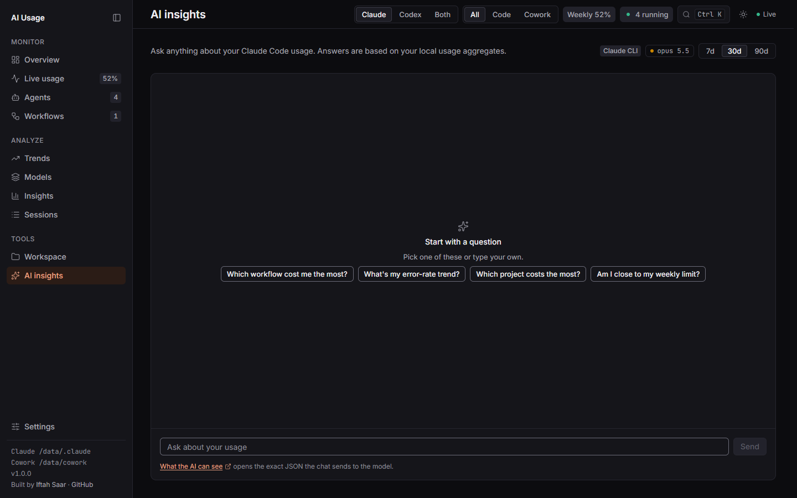

### Settings
Pinned to the bottom of the sidebar, in six sections you can jump to from the palette (`/settings#alerts`): **General** (usage mode: auto / subscription / API), **Display** (theme, week start), **Alerts** (agent alerts — visual / notification / sound — and rate-limit alert thresholds), **Spending limits** (USD caps with budget alerts at the first crossing of 70 / 90 / 100% of a cap), **AI** (provider, model, API key — stored only in your browser) and **Data** (the history archive, data folders, version and update, and the **telemetry** opt-out).

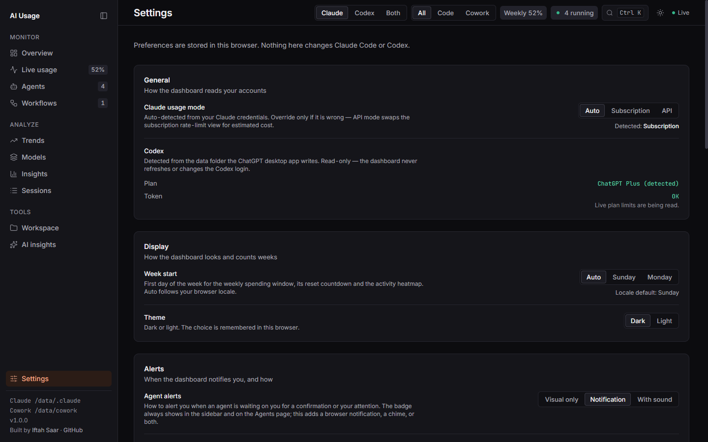

---

## Quick start

Requires [Node.js](https://nodejs.org) 22.5+ (`engines` in `package.json`; the parsed-scan cache uses the built-in `node:sqlite`, and the Docker image runs Node 24).

```bash
git clone https://github.com/iftahs/claude-dashboard.git
cd claude-dashboard
npm install
npm run dev
```

Then open the URL Vite prints (default <http://localhost:5180>). The dashboard populates as soon as you've used Claude Code on this machine.

`npm run dev` starts two processes via `concurrently`:

- a small **Express backend** (port `8788` in dev) that scans `~/.claude` and serves aggregated JSON,
- the **Vite** dev server for the React UI (port `5180`), which proxies `/api` to the backend.

Other scripts:

```bash
npm run build     # typecheck (tsc -b) + design-system lint + production build into dist/
npm run preview   # serve the built dist/ locally
npm run typecheck # tsc -b only
npm test          # node:test unit tests for the server logic
npm run lint      # design-system check (tiers, tokens, folder contract) — no ESLint
npm run verify    # typecheck + tests + lint: the bar before a change is done
npm run docs:ds   # regenerate the component index in src/components/design-system/design.md
npm run tokens    # regenerate src/styles/tokens.css from src/styles/tokens.json
npm run docker:up # rebuild + (re)start the container — run after every code change
npm run docker:down
npm run docker:logs
```

Fonts are self-hosted (Inter and JetBrains Mono come from npm packages and are bundled into the build), so the app makes no Google Fonts request.

## Run with Docker (always-on)

Want the dashboard always available without running `npm` each time? Run it as a container. It builds the UI, serves everything from one Express process on port `8787`, and mounts your `~/.claude` folder **read-only**.

1. Copy the env template and point it at your Claude data folder:

   ```bash
   cp .env.example .env
   ```

   Edit `.env` and set `CLAUDE_DIR_HOST` to your real path (use forward slashes on Windows):

   ```
   CLAUDE_DIR_HOST=C:/Users/you/.claude
   ```

   If you use the ChatGPT desktop app, `npm run docker:up` also fills in `CODEX_DIR_HOST` (your `~/.codex`) so the container can read Codex data; leave it blank to opt out.

   To enable the **AI insights** backend in Docker, either set `WITH_CLAUDE_CLI=1` (bundles the `claude` CLI so it can run `claude -p` against your mounted token) or provide an `ANTHROPIC_API_KEY` — both are documented in [`.env.example`](.env.example). You can also just set an API key at runtime in Settings → AI instead.

2. Build and start:

   ```bash
   npm run docker:up          # or: docker compose up -d --build
   ```

3. Open <http://localhost:8787>.

**It only answers on this machine.** The port is published on `127.0.0.1`, and that is what keeps it local. The server also rejects requests whose `Host` isn't `localhost`, `127.0.0.1` or `::1`, and any cross-site or non-JSON `POST`, so web pages you visit can't reach it through DNS rebinding or a forged form. Those checks protect your browser; they are not access control. The API serves your transcripts and can spend your Claude quota through AI insights, so it is not exposed to your network by default. To open it from another device on your LAN, set both in `.env` and rerun `npm run docker:up`:

```
DASHBOARD_BIND=0.0.0.0
ALLOWED_HOSTS=192.168.1.20,my-desktop.local
```

Anyone who can reach that address can then read everything the dashboard shows. `ALLOWED_HOSTS` does not change that: any client other than a browser can simply send `Host: localhost`. `npm run docker:up` also writes your host's timezone into `.env` (`TZ`, only if absent) so day buckets match your local days.

The container uses `restart: unless-stopped`, so it comes back automatically after a crash or reboot (as long as Docker Desktop is set to start on login). Stop it with `npm run docker:down`. To change the host port, edit the `ports` mapping in `docker-compose.yml` and change only the first port number (e.g. `"${DASHBOARD_BIND:-127.0.0.1}:9000:8787"`). Dropping the address part (plain `"9000:8787"`) publishes the port on every interface.

> **Docker has no hot reload.** After any code change, run `npm run docker:up` again to rebuild and restart.

## Optional integrations

All are auto-detected — if you don't use them, nothing changes in the UI.

- **Cowork** — Claude's desktop app writes standard Claude Code JSONL in its own folder. When the dashboard finds it, a **surface toggle (All / Code / Cowork)** appears in the top bar and a Code-vs-Cowork split shows up on Trends. Code-only users see the dashboard unchanged. Point `COWORK_DIR` / `COWORK_DIR_HOST` at it only if it lives somewhere non-standard.
- **ChatGPT desktop / Codex** — the ChatGPT desktop app's coding agent (Codex) keeps its transcripts in `~/.codex`. When that folder exists a **[platform switcher](#platform-switcher--claude--codex--both) (Claude / Codex / Both)** appears in the top bar and re-points the whole dashboard — Overview, Live usage, Agents, Trends, Models, Insights, Sessions and Workspace all read Codex instead of Claude, or both at once with a side-by-side daily comparison. Costs for Codex are OpenAI list-price estimates (gpt-5.5 / gpt-5.6 / gpt-6 rates; the internal review model is unpriced). Set `CODEX_DIR` / `CODEX_DIR_HOST` only for a non-standard location; `npm run docker:up` writes `CODEX_DIR_HOST` for you, and a blank value opts out.
- **LiteLLM gateway** — if you route Claude Code through a [LiteLLM](https://litellm.ai) proxy, set `LITELLM_BASE_URL` / `LITELLM_API_KEY` (or just reuse `ANTHROPIC_BASE_URL` / `ANTHROPIC_AUTH_TOKEN`) and the dashboard will show your **real billed cost** — month-to-date and per-day on Trends, and against your spend caps — instead of the estimate.

## Live limits and sign-in

The live limit bars (Overview, Live usage and the top-bar limit status) need a valid Claude sign-in token on disk — the one Claude Code already stores. If the dashboard says the OAuth token or Claude.ai session has expired, run `claude` once in a terminal: Claude Code rewrites `~/.claude/.credentials.json` and the dashboard picks it up on the next poll, with no rebuild or restart. Until then the page falls back to estimates computed from your local logs. On macOS with Docker, the token lives in the Keychain — see below.

## macOS: keeping the OAuth token fresh

On macOS, Claude Code stores its OAuth token in the **Keychain**, which a Docker container can't reach. `npm run docker:up` therefore copies the token into `~/.claude/.dashboard-oauth-cache.json` (read by the container) *and* installs a small launchd agent (`com.claude-dashboard.token-sync`) that re-syncs it every 15 minutes — otherwise the snapshot's access token expires within hours and the Live usage page degrades to "OAuth token expired". The running container picks up the refreshed file automatically; no rebuild or restart needed.

- `npm run token-sync:status` — check the agent + cached-token health
- `npm run token-sync` — one-shot manual sync
- `npm run token-sync:uninstall` — remove the agent (Live usage will then show "OAuth token expired" a few hours after each `docker:up`)
- Log: `~/Library/Logs/claude-dashboard/token-sync.log`

The agent bakes in the absolute paths of your `node` binary and this repo, so re-run `npm run token-sync:install` (or just `npm run docker:up`, which self-heals it) after upgrading/removing that Node version or moving the repo. If you have several checkouts, the last one to install wins — harmless, they all write the same cache file. **Linux/Windows are unaffected**: there Claude Code keeps `~/.claude/.credentials.json` fresh itself and the container reads it directly.

## Changing the Claude data folder

By default the backend reads from your home directory:

| OS | Default path |
|----|--------------|
| Windows | `C:\Users\<you>\.claude` |
| macOS / Linux | `~/.claude` |

This is detected automatically — the path shown in the sidebar is just *your* machine's home folder at runtime. If your logs live somewhere else (a custom install, a backup, another user's export), point the backend at it with the `CLAUDE_DIR` environment variable:

**macOS / Linux**
```bash
CLAUDE_DIR="/path/to/.claude" npm run dev
```

**Windows (PowerShell)**
```powershell
$env:CLAUDE_DIR = "D:\backups\.claude"; npm run dev
```

**Windows (cmd)**
```cmd
set CLAUDE_DIR=D:\backups\.claude && npm run dev
```

To change the backend port, set `SERVER_PORT`. `vite.config.ts` reads the same variable for its `/api` proxy, so if you start the backend and the UI in separate shells, give both the same value.

## What this dashboard can and can't show

Everything is derived from what Claude Code records locally, plus the OAuth token it already stores — which is enough to show your **real** limits:

- **Real limits:** exact reset times and % used for the 5-hour window, the weekly all-models cap and each per-model cap, read live from Anthropic's usage API with your existing token — including your plan tier and any extra-usage credits.
- **Estimated costs:** the dollar figures are an *estimated equivalent* API price. A subscription has no per-token bill, so they answer "what would this have cost on pay-as-you-go?" — they are not an invoice. Configure a [LiteLLM gateway](#optional-integrations) to see real billed amounts instead.
- **Not shown — Claude.ai web / desktop chat usage:** that's server-side per-conversation and never written to `~/.claude`.
- **Not shown — Cowork sessions running in full-VM sandbox mode:** their transcripts stay inside the VM, so there's nothing on disk to read.
- **Partial — Codex (ChatGPT desktop):** local rollouts cover threads run on this machine; Codex Cloud tasks, ChatGPT web chats and mobile usage only appear in the server-side daily series the Codex platform view fetches with your token. Guardian auto-review tokens are folded into their parent thread.

You can also set your own USD **spending caps** in Settings → Spending limits to get gauges and budget alerts against those estimates.

## Privacy & telemetry

Your Claude usage data — logs, tokens, project paths, session contents — **never leaves your machine**. The only network calls the dashboard makes for *your* data reuse the OAuth token Claude Code already stores locally to read live usage and your plan from Anthropic, and — when the ChatGPT desktop app is installed — the token in `~/.codex/auth.json` to read your Codex limits and daily totals from OpenAI (`chatgpt.com/backend-api/wham/usage` and `/wham/profiles/me`; two GETs, never a token refresh, account id / e-mail stripped before anything reaches the UI). Beyond that, exactly two optional, opt-in paths reach the network:

### Anonymous product analytics

The app sends **anonymous product-analytics events** to [PostHog](https://posthog.com) so the author can see how many people use the dashboard and which features matter. This is deliberately minimal and privacy-hardened:

- **What's sent:** which page is opened, exports, source-toggle/range changes, an anonymous install count, and a coarse plan/usage-mode label. Theme, sidebar and command-palette actions send nothing.
- **What's *never* sent:** OAuth tokens, file or project paths, project names, session IDs, transcript content, or any personal data. Browser autocapture and session replay are turned **off** so the UI's on-screen paths can't be scraped.
- **Opt out any time:**
  - In the app: **Settings → Data → Telemetry** (takes effect immediately, persisted in your browser).
  - At build time: build with `VITE_DISABLE_ANALYTICS=1` (set it in `.env` for Docker — see [`.env.example`](.env.example)) for a fully telemetry-free image.
- Analytics is also disabled automatically in local dev builds.

### AI insights (opt-in)

The AI insights page and the per-section AI buttons call a model **only when you ask** (open the page, send a message, or click a button). What's sent is a **privacy-safe aggregate summary** — weekly totals, top models/tools/projects (project *basenames* only), error/retry/delegation rates, and similar metrics.

- **What's *never* sent:** transcripts or message contents, full file/project paths, session IDs, or your OAuth token.
- **Which backend serves the call** (first available wins): an API key you set in **Settings → AI** (Claude / OpenAI / Gemini, stored only in your browser) → a server-side `ANTHROPIC_API_KEY` → the local `claude` CLI (`claude -p`, uses your subscription) → your Claude.ai OAuth token → otherwise the feature shows setup instructions and does nothing.
- **Server-side defaults** for Docker/self-host live in [`.env.example`](.env.example): `WITH_CLAUDE_CLI=1`, `ANTHROPIC_API_KEY`, and `AI_MODEL` (default `claude-opus-5-5`).
- If you never open the AI insights page or click an AI button, **no aggregates are ever sent.**

## Contributing

Contributions welcome! This is an open project:

- **Found a bug or have an idea?** [Open an issue](https://github.com/iftahs/claude-dashboard/issues).
- **Want to change something?** Fork the repo, create a branch, and [open a pull request](https://github.com/iftahs/claude-dashboard/pulls).

The UI is built on a strict atomic design system: components live in `src/components/design-system/{atoms,molecules,organisms,templates}`, each page is a thin component in `src/pages` wired by one `use<Name>Page` hook in `src/hooks`, and all business logic stays in hooks. `npm run lint` enforces the tier import rules and the design tokens (no raw hex, no ad-hoc sizes), and `npm run verify` runs the typecheck, tests and lint together. Read [`src/components/design-system/design.md`](src/components/design-system/design.md) — the component index — before building or changing any UI.

The `main` branch is maintained by the author; all external changes go through pull requests.

## License

[MIT](LICENSE) — free to use, modify, and distribute for everyone.

## Credits

Built by **Iftah Saar** — [iftah.dev](https://iftah.dev).
